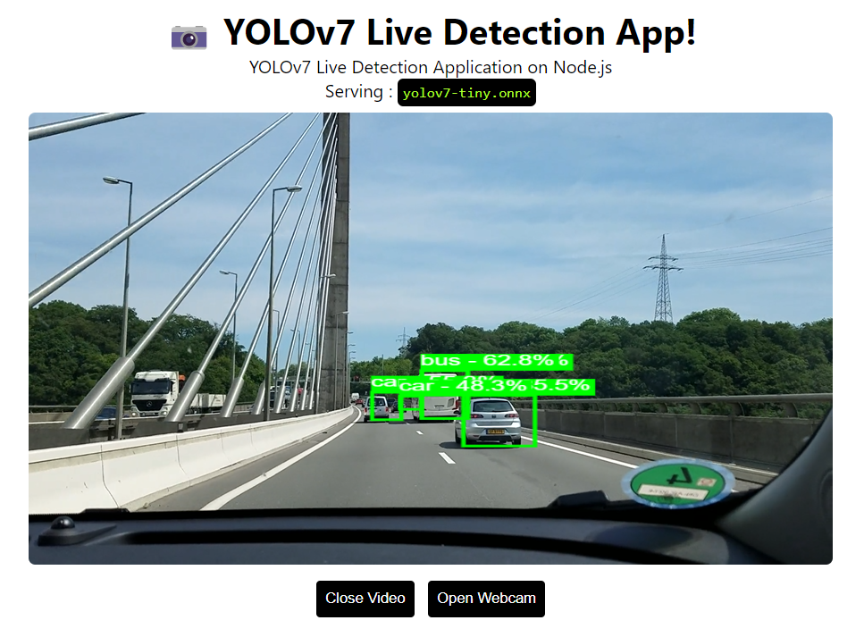

# YOLOv7 Node.js

<p align="center">
  
</p>


---

YOLOv7 Live Detection Application on Node.js.
Serving YOLOv7 in Node.js using `onnxruntime-node`.

## Setup

```bash
git clone https://github.com/Hyuto/yolov7-node.git
cd yolov7-node
yarn install # Install dependencies
```

## Run ~~

```bash
yarn start
```

## Model

YOLOv7 model converted to onnx model.

```
used model : yolov7-tiny
size       : 24 MB
```

### Use Another Model

> :warning: **Expensive Computation** : YOLOv7 model used in this repo is the smallest with size of 24 MB, so other models is definitely bigger than this which can exhausting computation.

Use another YOLOv7 model.

1. Clone [yolov7](https://github.com/WongKinYiu/yolov7) repository

   ```bash
   git clone https://github.com/WongKinYiu/yolov7.git && cd yolov7
   ```

   Install `requirements.txt` first

   ```bash
   pip install -r requirements.txt
   ```

   Then export desired YOLOv7 model and configurations to onnx

   ```bash
   python export.py --weights <YOLOv7-MODEL>.pt --grid --end2end --simplify \
        --topk-all 100 --iou-thres 0.65 --conf-thres 0.35 --img-size 640 640 --max-wh 640
   ```

   **Note** : You can run it on colab too

   [](https://colab.research.google.com/github/WongKinYiu/yolov7/blob/main/tools/YOLOv7onnx.ipynb)

2. Copy `yolov7*.onnx` to `./src`
3. Update `modelInfo` in `index.js` to new model name
   ```js
   ...
   // model configs
   const modelInfo = {
      name: "yolov7-tiny.onnx", // change this to new model filename
      inputShape: [1, 3, 640, 640], // change this if model input shape isn't 640 x 640
   };
   ...
   ```
4. Done! 😊

## Reference

https://github.com/WongKinYiu/yolov7
